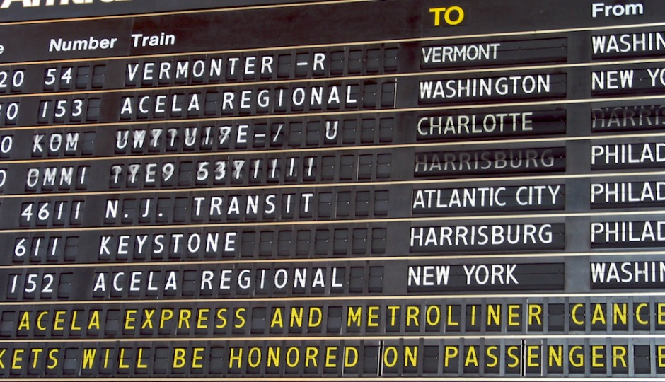

# Train Schedule App

## Technology Stack: HTML, CSS, Javascript, jQuery, Moment.js, Firebase Real-time Database, Firebase Authentication

- This is a train schedule application that incorporates Firebase to host arrival and departure data. It retrieves and manipulates this information with Moment.js. This website will provide up-to-date information about various trains, namely their arrival times and how many minutes remain until they arrive at their station.

- Only users who log into the site with their Google/GitHub/Email accounts can use the site.

- When adding trains, administrators will be able to submit the following:

  - Train Name
  - Destination
  - First Train Time -- in military time
  - Frequency -- in minutes

- This app calculates when the next train will arrive (relative to the current time).

- Users from many different machines will be able to view the same train times.

- Administrators can optionally delete and modify the train schedule with the remove/update buttons.
